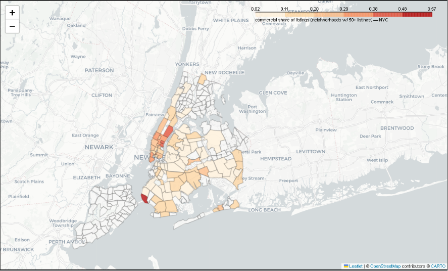
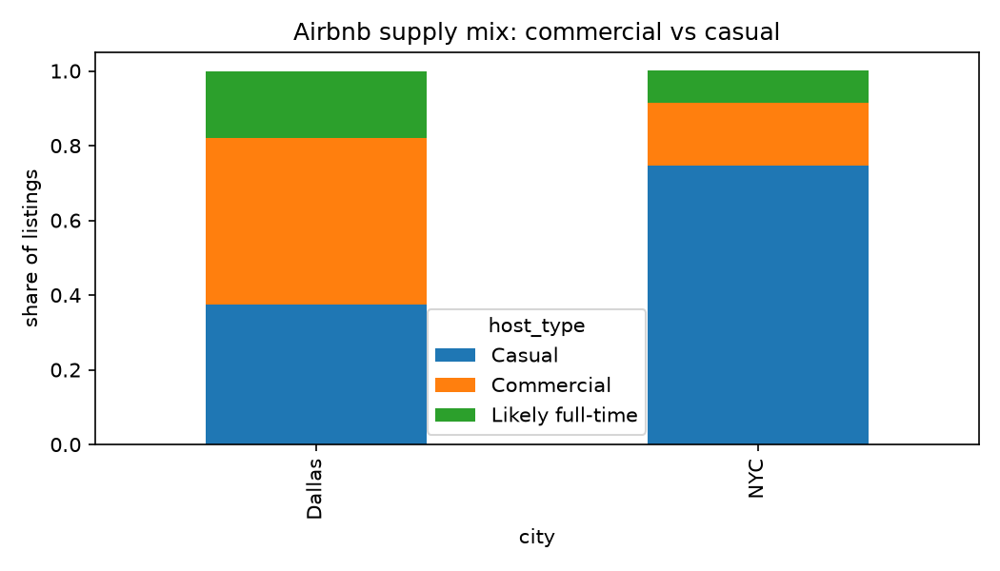

# Whose City Is It? Commercial vs. Casual Airbnb in NYC and Dallas

**Does enforcing a short-term-rental ban actually change who Airbnb is for?**

New York enforced Local Law 18 in September 2023. Dallas passed a similar ban, but a court
blocked it. That difference gives us a natural experiment: the same policy intent, enforced
in one city and frozen in the other. I compared 40,809 listings across the two cities to see
what each market actually looks like.

**Short answer:** In New York, where the ban is enforced, commercial operators are only
**17%** of listings. In Dallas, where it was blocked, they are **45%**, about **2.6 times**
higher. But New York's enforcement cut listings by roughly 92% without lowering rents, so a
ban on its own is not an affordability fix.

---

## Contents

1. [Why these two cities](#why-these-two-cities)
2. [Results at a glance](#results-at-a-glance)
3. [The data, and what to know about it](#the-data-and-what-to-know-about-it)
4. [How I defined "commercial," and how I tested it](#how-i-defined-commercial-and-how-i-tested-it)
5. [What I found](#what-i-found)
6. [Conclusion](#conclusion)
7. [Recommendation](#recommendation)
8. [Reproduce](#reproduce)
9. [Caveats and current status](#caveats-and-current-status)

---

## Why these two cities

Airbnb's defenders describe it as people renting a spare room. Critics describe it as
operators turning homes into full-time hotels and pulling housing off the long-term market.
Both can be true at once, so the useful question is how much of each city's market is
genuinely commercial, and whether enforcement changes that number. New York and Dallas are an
ideal pair because the policy is nearly identical and the only real difference is whether it
is being enforced.

## Results at a glance

- Commercial operators are **17%** of the market in New York (ban enforced) versus **45%** in
  Dallas (ban blocked), about **2.6x** higher.
- The gap holds at every threshold tested (**2.5x to 2.8x**), so it is not an artifact of one
  definition.
- It is **broad-based**: the ten largest hosts hold under 10% of listings in both cities.
- It **concentrates geographically**: the Manhattan core in NYC, and District 2 in Dallas
  (56% of that area's listings).
- New York's ban cut listings ~92% but **rents did not fall**, so a ban alone is not enough.

## The data, and what to know about it

I used the detailed Inside Airbnb listings files for both cities. A few things about this data
shaped how I worked with it, and they are worth stating up front because they affect how the
numbers should be read.

**Raw listing counts overstate active short-term supply, especially in New York.** New York
still shows 35,036 listings even though Local Law 18 cut bookable short-term rentals sharply.
This is because the dataset still includes listings that adapted to the law by requiring stays
of 30 nights or more, which are exempt from the rule, along with inactive listings that were
never removed. The takeaway is that a simple count of listings is misleading here, which is
exactly why I classified listings by behavior rather than just counting them.

**About half of all listings had no usable price.** Roughly 49% of listings came in with a
missing or invalid price. Rather than delete those rows, I flagged them and kept them, because
deleting them would have quietly removed a large and non-random part of the sample and biased
every result that followed. Because so much price data was missing, I did not estimate revenue,
and I based the analysis on fields that were reliably present, such as room type, availability,
and host listing counts.

**The two cities use slightly different columns.** New York's file has 91 columns and Dallas's
has 86. This is normal for Inside Airbnb, and I handled it by writing the cleaning steps to
check for a column before using it, so the same code runs on both cities.

## How I defined "commercial," and how I tested it

"Commercial" is not a label in the data, so I had to define it. I classified a listing as
commercial when it was an entire home, available most of the year, and run by a host who
operates more than one listing. That profile describes an operator rather than someone renting
their own home occasionally.

Because that definition involves a judgment call, I did not just trust it. I re-ran the
classification at three availability thresholds (90, 180, and 240 days) to confirm the result
was not an artifact of where I drew the line. It was not. The gap between the two cities held
at every threshold.

For the maps, I colored only neighborhoods with at least 50 listings, because a commercial
share is not meaningful when a neighborhood has only a handful of listings.

## What I found

| | Commercial | Likely full-time | Casual |
|---|---|---|---|
| **NYC** (ban enforced) | 16.9% | 8.5% | 74.7% |
| **Dallas** (ban blocked) | 44.6% | 17.9% | 37.5% |

**The gap is large and stable.** Dallas's commercial share is 2.5 to 2.8 times New York's
across every availability threshold I tested. New York's market is now mostly casual hosts
(75%), while Dallas's is close to evenly split, with commercial operators as the single
largest group.

**This is not driven by a few large operators.** The ten biggest hosts control only 10.3% of
listings in Dallas and 8.9% in New York. The commercial pressure comes from a broad group of
small operators, each running a few entire-home listings. That changes what effective policy
looks like, because the right target is the commercial pattern itself, not a short list of
large hosts.

**The pressure concentrates in specific places.** In New York it sits in the Manhattan tourist
core: Midtown (635 commercial listings), the Upper East Side (610, which is 45% of that area's
listings), and Hell's Kitchen (560). In Dallas it concentrates heavily in District 2, which
alone holds 1,030 commercial listings, or 56% of everything listed there. Interactive maps for
both cities are in `map_nyc.html` and `map_dallas.html`.

## Conclusion

Enforcement clearly changes the make-up of a short-term-rental market. Where the rule is
enforced, the market shifts toward ordinary hosts and commercial operators shrink to a
minority. Where the rule exists on paper but is not enforced, commercial operators remain close
to half of all supply. So enforcement is doing real work, and the difference between the two
cities is not subtle.

At the same time, the New York case is a warning against expecting too much from a ban.
Listings fell by roughly 92%, yet median rents did not fall. Removing short-term rentals
returns some units to the housing stock, but it does not, by itself, make a city affordable.
The honest conclusion is that enforcement is necessary but not sufficient. A city that wants
both fewer commercial conversions and lower rents needs to pair enforcement with new housing
supply.

## Recommendation

Regulate the commercial pattern, which is an entire home, available year round, run by a
multi-listing host, rather than banning the platform outright. Because the pressure comes from
many small operators rather than a few large ones, targeting the pattern is far more effective
than chasing a short list of big hosts.

Focus enforcement where commercial listings concentrate rather than spreading effort thin
across the whole city. In this study that meant District 2 in Dallas and the Manhattan core in
New York. Starting with the two or three highest-pressure areas returns the most housing for
the least effort.

Finally, pair any restriction with new housing supply, and set expectations accordingly. The
New York evidence shows that cutting listings does not automatically lower rents, so a ban
should be presented as one tool among several, not as an affordability solution on its own.

## Reproduce

1. Download the detailed `listings.csv.gz` and `neighbourhoods.geojson` for New York City and
   Dallas from [insideairbnb.com/get-the-data](https://insideairbnb.com/get-the-data).
2. Save them as `data/nyc_listings.csv.gz`, `data/dallas_listings.csv.gz`,
   `data/nyc_neighbourhoods.geojson`, and `data/dallas_neighbourhoods.geojson`.
3. Run `pip install -r requirements.txt`.
4. Open `whose_city_is_it.ipynb` and run it from top to bottom.

**Repo contents:** `whose_city_is_it.ipynb` (the analysis notebook with outputs),
`map_nyc.html` and `map_dallas.html` (interactive maps), `supply_mix.png` (chart),
`requirements.txt`. The raw `data/` files are not committed; re-download them with the steps
above.

## Caveats and current status

Inside Airbnb is a public scrape, and this uses one snapshot per city. "Commercial" is a
defined heuristic, although it is robust to the threshold I chose. Revenue is not estimated
because so many prices were missing. As of June 2026, New York's Local Law 18 remains in force
and Dallas's ban remains blocked, now pending a petition to the Texas Supreme Court.

**Tools:** Python (pandas, numpy, matplotlib, folium), data cleaning, geospatial
visualization, comparative analysis.